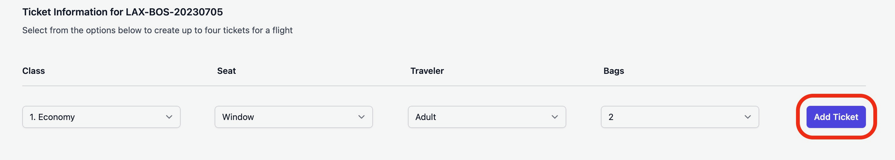

# Flight Tracker

## Summary

Flight Tracker is an application that allows a user to schedule flights by selecting an origin and destination airport, and a departure date.  A user can book an unlimited number of flights and can add up to four tickets for each flight.  

## Seed Data

Once you have unzipped the contents of `flight_tracker.zip` navigate to the flight_tracker directory and run the following command from your terminal:  `psql -d postgres < ./data/flight_tracker_seed_data.sql`.  

This will create the necessary database and tables and will populate the tables with seed data associated with the `lsuser1` account.  

## Starting application

Once you have navigated to the app directory and ran the above psql command run the terminal command `bundle install` to install the dependencies listed in the `Gemfile`.  You can then start the application by running the following command from your terminal: `ruby flight_tracker.rb`

## Sign up / Sign in
 
Before adding flights or accessing any flight or ticket edit page, the user must be logged in.  To log in you can either navigate to the sign up page (`/register` - there is also a link below the username and password inputs on the sign in page) or sign in with an existing account:
- Username: `lsuser1`
- Password: `lsuser1password`
- There will already be 20 flights (and related tickets) that have been scheduled on this account.

## Add Flight

To add a flight choose an option from each of the origin, destination and date select lists and click the "Add Flight" button.  

## Edit Flight

After adding a flight you will see it displayed on your dashboard with a "Edit" and "Remove" button.  Clicking the "Remove" button will delete the flight.  Clicking the "Edit" button will take you to the edit page for that flight.

On the flight edit page you can select a different origin, destination or date from the select lists and click "Update Flight" to edit the information associated with that flight.  

## Add Ticket

On the flight edit page you also have the option to add up to four tickets.  Choose an option from each of the class, seat, traveler and bags select lists adn click the "Add Ticket" button. 

## Edit Ticket

After adding a ticket you will see it displayed on your dashboard with a "Edit" and "Remove" button.  Clicking the "Remove" button will delete the ticket.  Clicking the "Edit" button will take you to the edit page for that ticket.

On the ticket edit page you can select a different class, seat, traveler or number of bags from the select lists and click "Update Ticket" to edit the information associated with that ticket.

## Technical Details

- I ran this application using Ruby 2.7.5
- I tested this application using Google Chrome (version 113.0.5672.126)
- I used PostgreSQL 14.8 to create the database